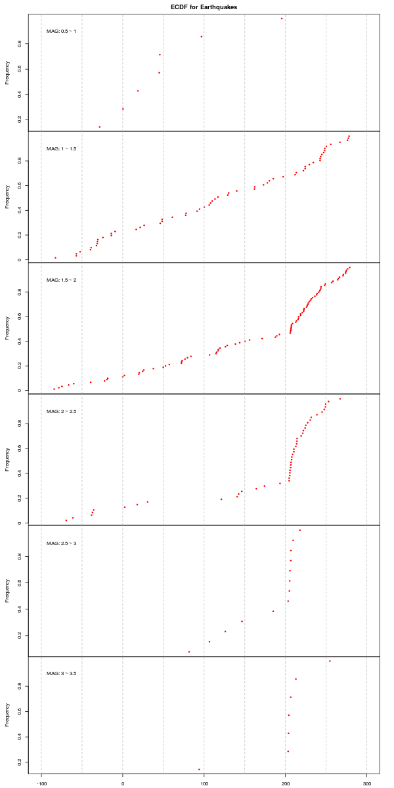

This is the code to plot ECDF for earthquakes of different MAG using 250.csv  

If you want to run the code, please enter the directory where you save the files in `setwd()` in .R file.  

The plot is:
 
