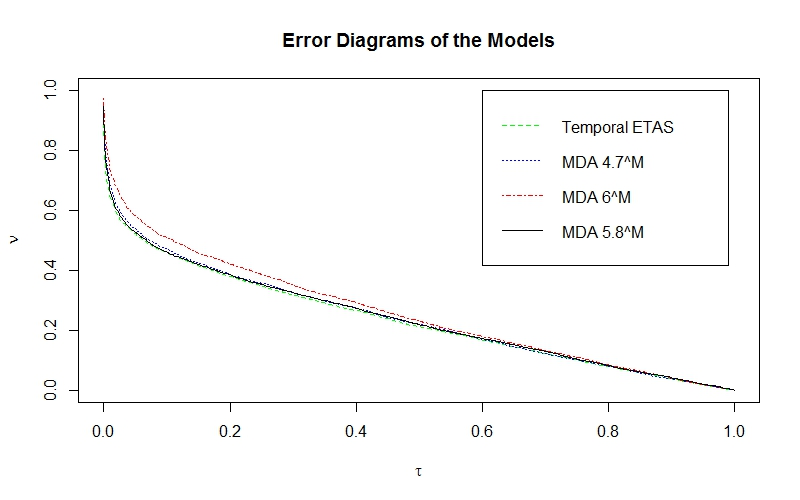
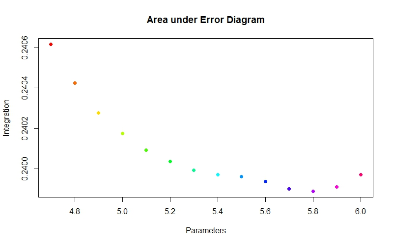

Explanations of the files:  
----  
[etas-training.R](etas-training.R) is Luen's full version code, includig both etas testing and MDA testing codes he used for his paper.  

[mda_test.r](mda_test.r) is the code for testing u from 4.7 to 6 based off of Luen's code (it can produce error diagrams and integral comparison that we presented).
You can find our presentation [here](http://bit.ly/18tRAmj)
The plots are  and 

[Quakers-MDAtest250.R](Quakers-MDAtest250.R) is the code specific for testing our small data set "250.csv"  
